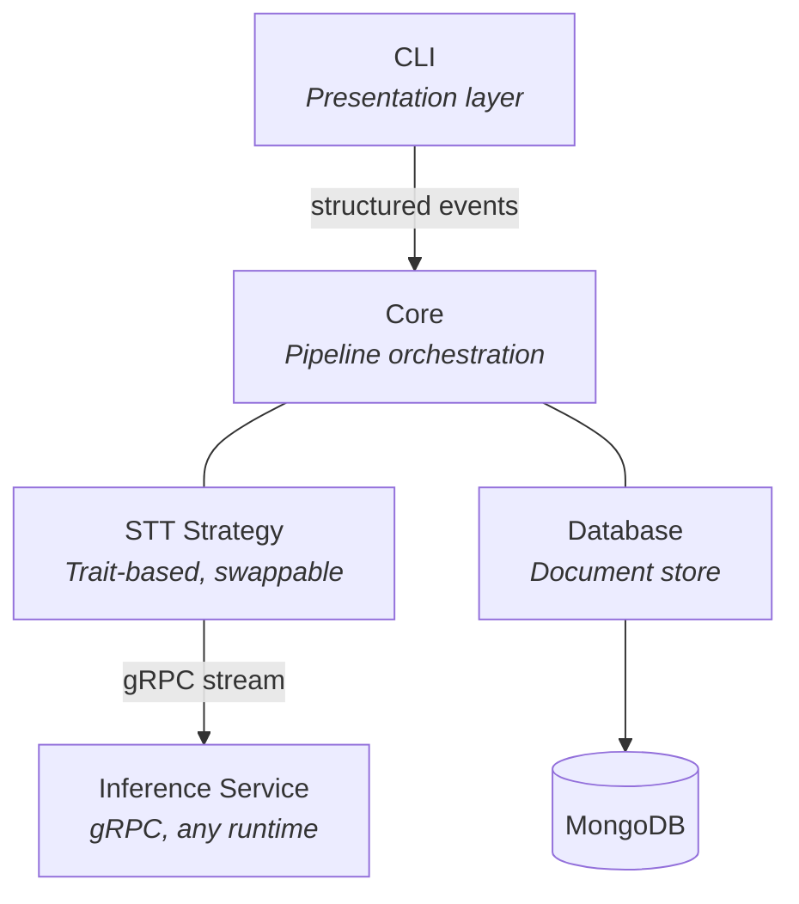

# Architecture

Vetta is designed around two core principles: **decoupled inference** and **strict separation between logic and
presentation**.

The speech-to-text engine is abstracted behind a trait, meaning the orchestration pipeline doesn't know or care which
model, runtime, or language powers transcription. Swapping from a local Whisper instance to a remote API is a
configuration change, not a rewrite.

The core library never produces user-facing output. It emits structured events that consumers — a CLI today, potentially
a GUI or API tomorrow — render however they choose.

## System Overview



## Pipeline

Every earnings call follows the same three-stage pipeline:

1. **Validate** — Check file integrity, format, and size before any processing begins.
2. **Transcribe** — Stream audio through the STT strategy and collect segments as they arrive.
3. **Store** — Persist the structured transcript to the database.

Each stage emits events. The core decides **what** happened; the consumer decides **how** to show it.

## Key Decisions

| Decision                | Rationale                                                                                                                  |
|-------------------------|----------------------------------------------------------------------------------------------------------------------------|
| Trait-based STT         | The pipeline is independent of any specific model or runtime. Strategies are swappable without touching orchestration.     |
| Streaming transcription | Segments are yielded as they're recognized, enabling real-time progress feedback and bounded memory usage.                 |
| Event-driven progress   | The core emits structured events instead of printing. Any consumer (CLI, GUI, API) can render them.                        |
| Contextual errors       | Errors carry diagnostic codes and actionable help, so failures are immediately understandable without reading source code. |

```