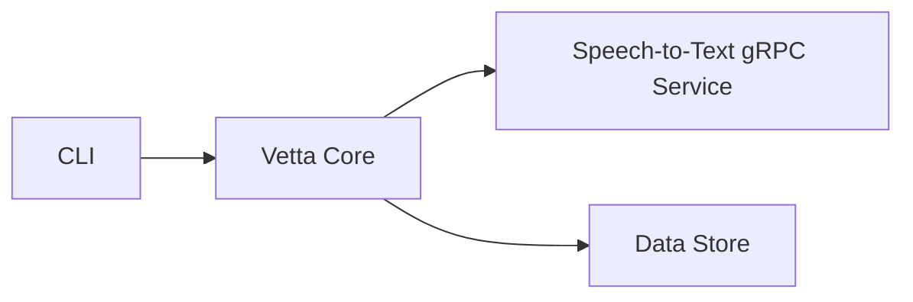

# Architecture

Vetta is designed around two core principles: **decoupled inference** and **strict separation between logic and
presentation**.

Speech-to-text is exposed as a **streaming gRPC service** with a well-defined protobuf interface. The orchestration
pipeline coordinates audio resolution, optional diarization, transcription, and post‑processing, but remains **agnostic
to downstream consumers**.

The core library never produces user-facing output. It emits **structured transcript chunks and events** that
consumers (CLI, APIs, indexers) render or store however they choose.

## System Overview

## Speech-to-Text Pipeline

The STT service implements a **streaming transcription pipeline**:

1. Audio resolution and validation (URL, upload, or inline audio)
2. Audio preprocessing for inference
3. Optional speaker diarization (lazy-loaded, configuration-driven)
4. Whisper transcription (word-level timestamps supported)
5. Speaker label assignment (segment- and word-level)
6. Post-processing (stitching, entity correction, punctuation, truecasing)
7. Streaming transcript chunks to the caller

The service streams `TranscriptChunk` messages incrementally, enabling:

- Real-time progress
- Bounded memory usage
- Early indexing or consumption

Diarization and post-processing are **optional** and can be enabled or disabled via configuration without changing the
pipeline.

## Storage

Two collections with distinct responsibilities:

- **`earnings_calls`** — One document per call. Immutable source of truth.
    - Full transcript (speaker-labeled, post-processed)
    - Speaker registry
    - Ingestion and processing metadata
    - No embeddings

- **`earnings_chunks`** — One document per dialogue turn.
    - Search-optimized text
    - Embeddings
    - Denormalized metadata for filtering (speaker, call ID, timestamps)

This separation allows chunking strategies, embedding models, and reprocessing logic to evolve independently.
Reprocessing chunks never mutates source transcripts.

See [Data Model](/technical/data-model) for schemas, field references, and indexes.

## Search

`earnings_chunks` supports three retrieval modes:

- **Semantic** — Atlas Vector Search over embeddings with metadata pre-filtering
- **Full-text** — Atlas Search using a language analyzer
- **Hybrid** — Candidates from both paths merged and reranked application-side

## Key Decisions

| Decision                   | Rationale                                                                                                |
|----------------------------|----------------------------------------------------------------------------------------------------------|
| gRPC-based STT service     | Clear contract, streaming support, language-agnostic clients                                             |
| Streaming transcription    | Segments yield as recognized; enables progress reporting and early consumption                           |
| Optional diarization       | Speaker labeling when available, graceful degradation when not                                           |
| Post-processing pipeline   | Improves readability and normalization without affecting raw timing data                                 |
| Event / chunk-based output | Core emits structured data; presentation is handled by consumers                                         |
| Two-collection model       | Source transcripts and search chunks are separated so embeddings and chunking can evolve independently   |
| Denormalized filters       | Metadata lives on chunks so search can filter without cross-collection joins                             |
| Context windows on chunks  | Each chunk stores neighboring turns, giving rerankers and LLMs surrounding context without extra queries |
